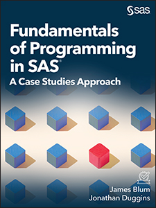

# Fundamentals of Programming in SAS: A Case Studies Approach #
 

 

By James Blum and Jonathan Duggins

 
This repository contains the sample code for the book <i>Fundamentals of Programming in SAS: A Case Studies Approach</i>. All examples are in the form of file types SAS data sets, .csv, .xlsx, and .txt.

## Description
<b>Unlock the essentials of SAS programming!</b> 
<i>Fundamentals of Programming in SAS: A Case Studies Approach</i> gives a complete introduction to SAS programming. Perfect for students, novice SAS users, and programmers studying for their Base SAS certification, this book covers all the basics, including:
<ul>
<li>working with data
<li>creating visualizations
<li>data validation
<li>good programming practices
</ul>
Experienced programmers know that real-world scenarios require practical solutions. Designed for use in the classroom and for self-guided learners, this book takes a novel approach to learning SAS programming by following a single case study throughout the text and circling back to previous concepts to reinforce material. Readers will benefit from the variety of exercises, including both multiple choice questions and in-depth case studies. Additional case studies are also provided online for extra practice. This approach mirrors the way good SAS programmers develop their skills—through hands-on work with an eye toward developing the knowledge necessary to tackle more difficult tasks. After reading this book, you will gain the skills and confidence to take on larger challenges with the power of SAS.

## Details

*Epub* ISBN: 978-1-63526-669-6  
*Kindle* ISBN: 978-1-63526-670-2  
*PDF* ISBN: 978-1-63526-671-9 
*Paperback* ISBN: 978-1-63526-672-6  
*Hardback* ISBN: 978-1-64295-228-5

<a href="https://www.sas.com/storefront/aux/en/sppgmfun/71342_excerpt.pdf">Table of Contents and Book Excerpt </a>

About the Authors 
<a href="https://support.sas.com/en/books/authors/jim-blum.html">James Blum</a> 
<a href="https://support.sas.com/en/books/authors/jonathan-duggins.html">Jonathan Duggins</a>

 

## License

This project is licensed under the [Apache 2.0 License](./LICENSE).
